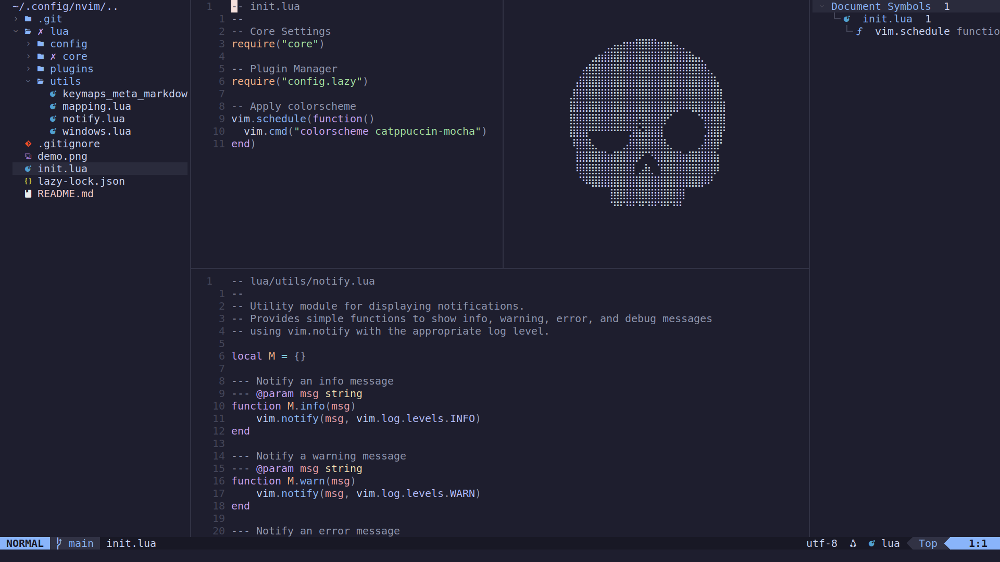

# My Neovim Configuration

This is my Neovim setup, primarily tailored for C++ development.

If you’d like to use my Neovim configuration, please **fork** this repository.
I frequently update it, keymaps, plugins, and other settings may change over time.

---

## About Keymaps

All keymap definitions are stored in [lua/core/keymaps_meta.lua](lua/core/keymaps_meta.lua).  
This file contains only metadata about each keymap, such as its **group**, **mode(s)**, **lhs** (the key sequence), and **description**.

To add or modify keymaps, refer to the top comments in both  
[lua/core/keymaps.lua](lua/core/keymaps.lua) and [lua/core/keymaps_meta.lua](lua/core/keymaps_meta.lua).

The table below is automatically generated by  
[lua/utils/keymaps_meta_markdown_gen.lua](lua/utils/keymaps_meta_markdown_gen.lua).

## Keymaps

| Group | Mode | Key | Description |
|-------|------|-----|-------------|
| General | t | ` <Esc><Esc> ` | Exit Terminal Mode |
| General | n | ` <Esc> ` | Clear Search Highlights |
| General | n | ` <C-.> ` | Toggle Terminal |
| General | t | ` <C-.> ` | Toggle Terminal |
| General | n | `` <leader>` `` | Save And Reload Config |
| General | n | ` N ` | Previous Search Centered |
| General | n | ` H ` | Jump To Line Start |
| General | n | ` n ` | Next Search Centered |
| General | n | ` L ` | Jump To Line End |
| NvimTree | n | ` <leader>e ` | Toggle NvimTree |
| NvimTree | n | ` <C-S-e> ` | Toggle NvimTree |
| Files | n | ` <leader>X ` | Save And Quit All Windows |
| Files | n | ` <leader>Q ` | Quit All Windows |
| Files | n | ` <leader>w ` | Save Buffer |
| Files | n | ` <C-s> ` | Save Buffer |
| Files | n | ` <leader>rf ` | Rename File |
| Files | n | ` <leader>W ` | Save All Buffers |
| Files | n | ` <C-S-s> ` | Save All Buffers |
| Files | n | ` <leader>q ` | Quit Window |
| Files | n | ` <leader>x ` | Save And Quit Window |
| FZF | n | ` <leader>fo ` | FZF: Recent Files |
| FZF | n | ` <leader>fb ` | FZF: Find Buffers |
| FZF | n | ` <leader>fh ` | FZF: Help Tags |
| FZF | n | ` <leader>ff ` | FZF: Find Files |
| FZF | n | ` <leader>fg ` | FZF: Live Grep |
| Buffers | n | ` <leader>bd ` | Delete Buffer |
| Tabs | n | ` <leader>tc ` | Close Tab |
| Tabs | n | ` <leader>tn ` | Next Tab |
| Tabs | n | ` ]t ` | Next Tab |
| Tabs | n | ` <leader>te ` | New Tab |
| Buffers | n | ` <leader>bn ` | Next Buffer |
| Buffers | n | ` <S-l> ` | Next Buffer |
| Tabs | n | ` <leader>tp ` | Previous Tab |
| Tabs | n | ` [t ` | Previous Tab |
| Buffers | n | ` <leader>bp ` | Previous Buffer |
| Buffers | n | ` <S-h> ` | Previous Buffer |
| Editing | n | ` < ` | Indent Line Left |
| Editing | n | ` > ` | Indent Line Right |
| Editing | v | ` < ` | Indent Selection Left |
| Editing | v | ` > ` | Indent Selection Right |
| Editing | n | ` p ` | Paste & Auto Indent |
| Editing | x | ` p ` | Paste & Auto Indent |
| LSP | n | ` <leader>ic ` | LSP: Incoming Calls |
| LSP | n | ` <leader>ld ` | LSP: Document Diagnostics |
| LSP | n | ` gD ` | LSP: Go To Declaration |
| LSP | n | ` <leader>oc ` | LSP: Outgoing Calls |
| LSP | n | ` <leader>lw ` | LSP: Workspace Diagnostics |
| LSP | n | ` <leader>rn ` | LSP: Rename Symbol |
| LSP | n | ` K ` | LSP: Hover |
| LSP | n | ` <leader>= ` | LSP: Format Buffer |
| LSP | n | ` <leader>ca ` | LSP: Code Action |
| LSP | n | ` gr ` | LSP: Go To References |
| LSP | n | ` gi ` | LSP: Go To Implementation |
| LSP | n | ` gy ` | LSP: Go To Type Definition |
| LSP | n | ` gd ` | LSP: Go To Definition |
| LSP | n | ` <leader>lS ` | LSP: Workspace Symbols |
| LSP | n | ` <leader>ls ` | LSP: Document Symbols |
| Windows | n | ` <C-S-l> ` | Resize Window Wider |
| Windows | n | ` <C-S-Right> ` | Resize Window Wider |
| Windows | n | ` <C-S-j> ` | Resize Window Shorter |
| Windows | n | ` <C-S-Down> ` | Resize Window Shorter |
| Windows | n | ` <leader>sh ` | Horizontal Split |
| Windows | n | ` <C-S-k> ` | Resize Window Taller |
| Windows | n | ` <C-S-Up> ` | Resize Window Taller |
| Windows | n | ` <leader>sv ` | Vertical Split |
| Windows | n | ` <C-h> ` | Move To Left Window |
| Windows | n | ` <C-Left> ` | Move To Left Window |
| Windows | n | ` <C-l> ` | Move To Right Window |
| Windows | n | ` <C-Right> ` | Move To Right Window |
| Windows | n | ` <C-j> ` | Move To Lower Window |
| Windows | n | ` <C-Down> ` | Move To Lower Window |
| Windows | n | ` <C-k> ` | Move To Upper Window |
| Windows | n | ` <C-Up> ` | Move To Upper Window |
| Windows | n | ` <C-S-h> ` | Resize Window Narrower |
| Windows | n | ` <C-S-Left> ` | Resize Window Narrower |
